##  第1节 理解什么是布局？

### 什么是布局？

布局是一种多图排列（Arranging multiple plots）,可以直观的布置图和控件

- 行(Row) 列(Column)
- 网格排列(Grid Arrangement)
- 选项卡式布局(Tabbed layout)

### 学习内容

- 横向布局（Rows of plots）
- 纵向布局（Columns of plots）
- 嵌套布局（Nested layouts）

### 本章主要使用的函数

​	横向布局：主要使用 `row()` 函数
​	纵向布局：主要使用`column()` 函数

### 横向布局

横向布局主要使用 `row()` 函数

```python
from bokeh.io import output_notebook,show
from bokeh.plotting import figure
from bokeh.sampledata.iris import flowers
from bokeh.layouts import row,column

#p1画法
p1 = figure(title = 'petal length & sepal length',plot_width = 300,plot_height = 300)
p1.circle(flowers['petal_length'],
         flowers['sepal_length'],
         size = 10)

#p2画法
p2 = figure(title = 'petal length & sepal width',plot_width = 300,plot_height=300)
p2.circle(flowers['petal_length'],
         flowers['sepal_width'],
         color='yellow')

#p3画法
p3 = figure(title = 'petal length & petal width',plot_width = 300,plot_height = 300)
p3.circle(flowers['petal_length'],
         flowers['petal_width'],
         size=10,
         color='red')

#横向布局
layout = row(p1,p2,p3)
output_notebook()
show(layout)
```

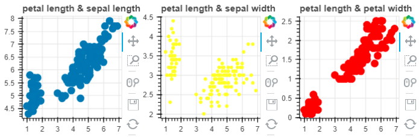

```python
from bokeh.io import output_notebook,show
from bokeh.layouts import column,row
from bokeh.plotting import figure

x = list(range(10))
y0 = x
y1 = [10 - i for i in x]
y2 = [abs(i - 3) for i in x]

#绘制三个图
p1 = figure(plot_width = 150,plot_height = 150)
p1.circle(x,y0,size=10,color='yellow',alpha=0.5)

p2 = figure(plot_width = 150,plot_height = 150)
p2.triangle(x,y1,size = 10,color = 'red',alpha = 0.8)

p3 = figure(plot_width = 150,plot_height = 150)
p3.square(x,y2,size = 10,color = 'green',alpha = 0.7)

r1 = row(p1,p2,p3)
output_notebook()
show(r1)

```

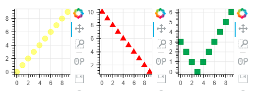

### 纵向布局

纵向布局主要使用 column() 函数。

```python
from bokeh.io import output_notebook,show
from bokeh.plotting import figure
from bokeh.sampledata.iris import flowers
from bokeh.layouts import row,column

#p1画法
p1 = figure(title = 'petal length & sepal length',plot_width= 200,plot_height=200)
p1.circle(flowers['petal_length'],
         flowers['sepal_length'],
         size=10)

#p2画法
p2 = figure(title = 'petal length & sepal width',plot_width = 200,plot_height = 200)
p2.circle(flowers['petal_length'],
         flowers['sepal_width'],
         size = 10,
         color = 'yellow')

#p3画法
p3 = figure(title = 'petal length & sepal length',plot_width = 200,plot_height = 200)
p3.circle(flowers['petal_length'],
         flowers['sepal_length'],
         color='green')

layout = column(p1,p2,p3)

output_notebook()
show(layout)
```

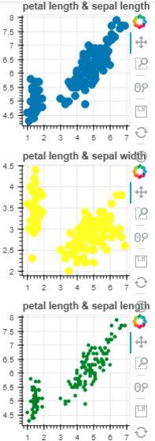

```python
from bokeh.io import output_notebook,show
from bokeh.layouts import column
from bokeh.plotting import figure

x = list(range(10))
y0 = x
y1 = [10 - i for i in x]
y2 = [abs(i - 3) for i in x]

#绘制三个图
p1 = figure(plot_width = 150,plot_height = 150)
p1.circle(x,y0,size=10,color='yellow',alpha=0.5)

p2 = figure(plot_width = 150,plot_height = 150)
p2.triangle(x,y1,size = 10,color = 'red',alpha = 0.8)

p3 = figure(plot_width = 150,plot_height = 150)
p3.square(x,y2,size = 10,color = 'green',alpha = 0.7)

col = column(p1,p2,p3)
output_notebook()
show(col)
```

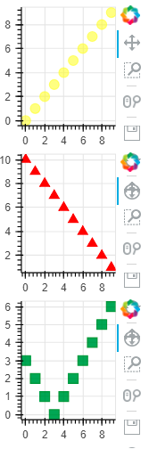

### 嵌套布局

可以嵌套行和列，获得更复杂的布局。

```python
from bokeh.io import output_notebook,show
from bokeh.layouts import column,row
from bokeh.plotting import figure

x = list(range(10))
y0 = x
y1 = [10 - i for i in x]
y2 = [abs(i - 3) for i in x]

#绘制三个图
p1 = figure(plot_width = 150,plot_height = 150)
p1.circle(x,y0,size=10,color='yellow',alpha=0.5)

p2 = figure(plot_width = 150,plot_height = 150)
p2.triangle(x,y1,size = 10,color = 'red',alpha = 0.8)

p3 = figure(plot_width = 150,plot_height = 150)
p3.square(x,y2,size = 10,color = 'green',alpha = 0.7)

output_notebook()
show(column(row(p1,p2),p3))
```

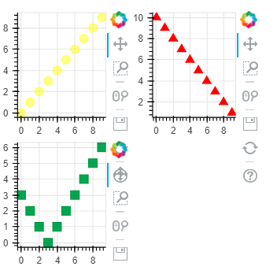

### 练习

横向布局

- 根据第一章中用过的文化水平与出生率的数据集，绘制生育能力与女性文化水平的散点图以及人口与女性文化水平的散点图。
- 通过使用 `row()` 方法，创建两个图的单行布局。

```python
from bokeh.plotting import figure, output_notebook, show
from bokeh.models import ColumnDataSource
import pandas as pd

# 从 bokeh.layouts 模块导入 row 函数
from bokeh.layouts import row

data = pd.read_excel('TREND01-5G-educ-fertility-bubbles.xls', skiprows=7, nrows=162)

source = ColumnDataSource(data)

# 创建第一个 figure 对象: p1
p1 = figure(x_axis_label='fertility (children per woman)', y_axis_label='female literacy (% population)',plot_width = 400 ,plot_height = 400)

# 向 p1 中添加圆形字形
p1.circle('fertility','female literacy', source = source)

# 创建第二个 figure 对象: p2
p2 = figure(x_axis_label='population', y_axis_label='female literacy (% population)',plot_width = 400 ,plot_height = 400)

# 向 p2 中添加圆形字形
p2.circle('population', 'female literacy', source = source,color='yellow')

# 将 p1 和 p2 放入水平的行：layout
layout = row(p1,p2)

# 指定输出并显示
output_notebook()
show(layout)
```

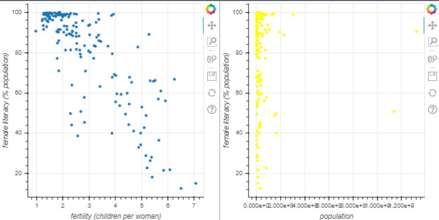

纵向布局

使用 `column()` 函数创建一个单列布局，使用的是上一个练习中创建的两个图。

```python
from bokeh.io import output_notebook, show
from bokeh.plotting import figure
from bokeh.models import ColumnDataSource
import pandas as pd

# 从 bokeh.layouts 模块导入 column 函数
from bokeh.layouts import column

data = pd.read_excel('TREND01-5G-educ-fertility-bubbles.xls',skiprows=7,nrows=162)

source = ColumnDataSource(data)

# 创建第一个 figure 对象: p1
p1 = figure(x_axis_label='fertility (children per woman)', y_axis_label='female literacy (% population)')

# 向 p1 中添加圆形字形
p1.circle('fertility', 'female literacy', source=source)

# 创建第二个 figure 对象: p2
p2 = figure(x_axis_label = 'population',y_axis_label = 'female literacy（% population）')

# 向 p2 中添加圆形字形
p2.circle('population','female literacy',source = source)

# 将 p1 和 p2 放入一列：layout
col = column(p1,p2)

# 指定输出并显示
output_notebook()
show(col)
data
```

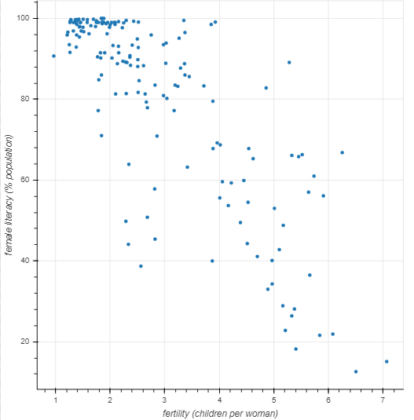

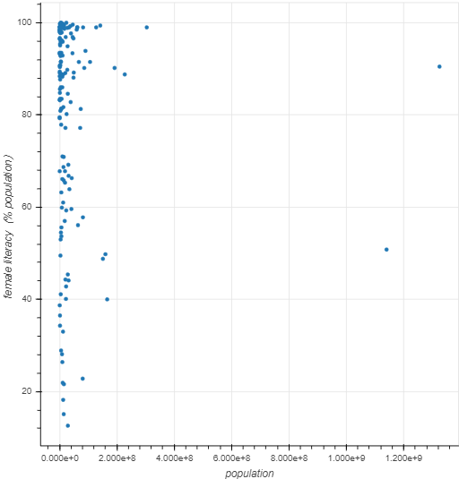

嵌套布局

通过组合行和列的布局来创建嵌套布局

```python
from bokeh.plotting import figure, output_notebook, show
from bokeh.sampledata.iris import flowers

# 从 bokeh.layouts 导入 row 和 column
from bokeh.layouts import row, column

p1 = figure(title='petal length vs. sepal length', plot_width=400, plot_height=400)
p1.circle(flowers['petal_length'],
          flowers['sepal_length'],
          size=10)

p2 = figure(title='petal length vs. sepal width', plot_width=400, plot_height=400)
p2.circle(flowers['petal_length'],
          flowers['sepal_width'],
          size=10, color='green')

p3 = figure(title='petal length vs. petal width', plot_width=400, plot_height=400)
p3.circle(flowers['petal_length'],
          flowers['petal_width'],
          size=10, color='red', fill_color='white')

#创建一个行布局，名为 row1
row1 =  row(p1, p2)

#创建一个列布局，参数中包含前面的 row1
layout = column(p3, row1)
output_notebook()
show(layout)
```

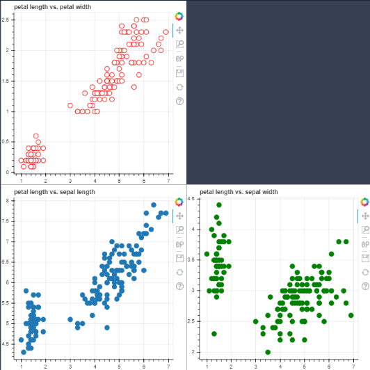

## 第二节 布局进阶

高级布局

- 网格布局（Gridplot）
- 选项卡式布局（Tabbed layout）

bokeh 还支持网格布局和选项卡式布局

-  横向布局：`row()`
-  纵向布局：`column()`
-  网格布局：`gridplot()`
-  选项卡式布局：`Panel()`, `Tabs()`

### 网格布局

gridplot（）函数可用于在网格布局中排列图片。gridplot（）还将所有工具收集到一个工具栏中，并且当前活动的工具对于网格中的所有图都是相同的。 通过传递 None 可以在网格中留下“空白”空间。

gridplot（）不同之处在于，它不需要传递元组作为输入，而是需要一个列表，其中每个子列表代表网格中的一行 

示例1：

```python
from bokeh.io import output_notebook,show
from bokeh.plotting import figure
from bokeh.sampledata.iris import flowers

#p1画法
p1 = figure(title = 'petal length & sepal length',plot_width = 300,plot_height = 300)
p1.circle(flowers['petal_length'],
         flowers['sepal_length'],
         size = 10)

#p2画法
p2 = figure(title = 'petal length & sepal width',plot_width = 300,plot_height = 300)
p2.circle(flowers['petal_length'],
         flowers['sepal_width'],
         size = 10,
         color = 'green')

#p3画法
p3 = figure(title = 'petal length & petal width',plot_width = 300,plot_height = 300)
p3.circle(flowers['petal_length'],
         flowers['petal_width'],
         size = 10,color='red',fill_color = 'white')

#引入网格布局相关模块
from bokeh.layouts import gridplot

layout = gridplot([[None,p1],
                   [p2,p3]],
                 toolbar_location=None)
output_notebook()
show(layout)

```

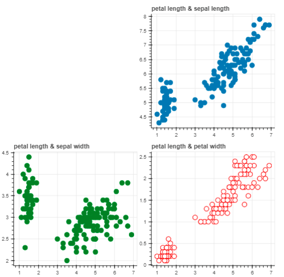

示例2：

```python
from bokeh.io import output_notebook,show
from bokeh.layouts import gridplot
from bokeh.plotting import figure

x = list(range(11))
y0 = x
y1 = [10 - i for i in x]
y2 = [abs(i - 5) for i in x]

#绘制三张图
s1 = figure(background_fill_color = '#fafafa')
s1.circle(x,y0,size=12,alpha=0.8,color='#436754')

s2 = figure(background_fill_color = '#234167')
s2.triangle(x,y1,size=12,alpha=0.8,color = '#fbf322')

s3 = figure(background_fill_color = '#765678')
s3.square(x,y2,size=12,alpha=0.8,color = '#fb2134')

#网格布局
grid = gridplot([[s1,s2],[None,s3]],plot_width = 200,plot_height = 200)
output_notebook()
show(grid)

```

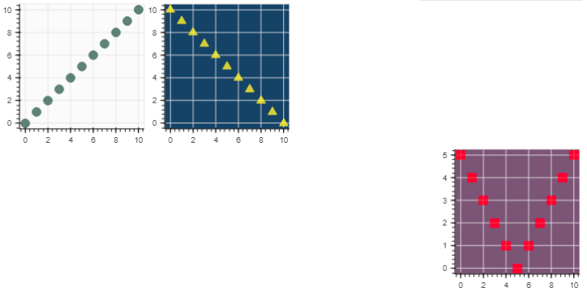

 也可以仅传递图表列表并指定要在网格中显示的列数```ncols```。 例如: 

```python
from bokeh.io import output_notebook,show
from bokeh.layouts import gridplot
from bokeh.plotting import figure

x = list(range(11))
y0 = x
y1 = [10 - i for i in x]
y2 = [abs(i - 5) for i in x]

#绘制三张图
s1 = figure(background_fill_color = '#fafafa')
s1.circle(x,y0,size=12,alpha=0.8,color='#436754')

s2 = figure(background_fill_color = '#234167')
s2.triangle(x,y1,size=12,alpha=0.8,color = '#fbf322')

s3 = figure(background_fill_color = '#765678')
s3.square(x,y2,size=12,alpha=0.8,color = '#fb2134')

#网格布局
grid = gridplot([s1,s2,s3],ncols=3,plot_width = 200,plot_height = 200)
output_notebook()
show(grid)
```

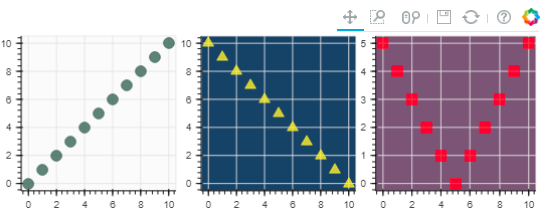

上图ncols改成2的话则结果如下：

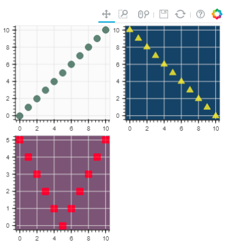

可以传入```plot_width```和```plot_height```参数，这些参数将用于设置所有绘图的大小。
默认情况下，```gridplot```会将每个子图中的所有工具合并到连接到网格的单个工具栏上。若要禁用此行为，可以将选项```merge_tools```设置为```False```。 

例如：

```python
from bokeh.io import output_notebook,show
from bokeh.layouts import gridplot
from bokeh.plotting import figure

x = list(range(11))
y0 = x
y1 = [10 - i for i in x]
y2 = [abs(i - 5) for i in x]

#绘制三张图
s1 = figure(background_fill_color = '#fafafa')
s1.circle(x,y0,size=12,alpha=0.8,color='#436754')

s2 = figure(background_fill_color = '#234167')
s2.triangle(x,y1,size=12,alpha=0.8,color = '#fbf322')

s3 = figure(background_fill_color = '#765678')
s3.square(x,y2,size=12,alpha=0.8,color = '#fb2134')

#网格布局，加入merge_tools=False
grid = gridplot([s1,s2,s3],ncols=2,plot_width = 200,plot_height = 200,merge_tools=False)
output_notebook()
show(grid)

```

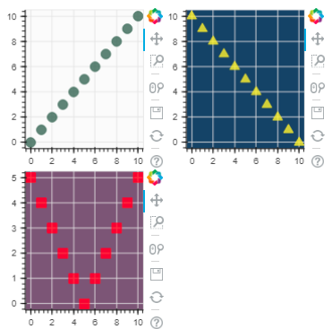

### 选项卡式布局 

功能：可以在两个可视化文件之间进行全尺寸切换，而不必将它们压缩到彼此相邻或重叠的位置 

设置选项卡步骤

1. 从 bokeh.models.widgets 模块导入 Panel 函数和 Tabs 函数。
2. 通过 Panel 函数，我们为每一个选项卡页创建一个面板。
   - Panel 函数包含两个参数，第一个是 child 参数，它代表选项卡页中具有什么内容。放置的内容可以是单个图对象，也可以是各种布局对象。
   - 第二个参数 title 代表显示在选项卡页上的标题。
3. 使用 Tabs 函数来显示最终布局。其中 tabs 参数是一个包含面板名的列表。

```python
from bokeh.io import output_notebook,show
from bokeh.plotting import figure
from bokeh.sampledata.iris import flowers

#p1画法
p1 = figure(title='petal length & sepal length', plot_width=200, plot_height=200)
p1.circle(flowers['petal_length'],
         flowers['sepal_length'],
         size=10)


#p2画法
p2 = figure(title='petal length & sepal width',plot_width = 200,plot_height = 200)
p2.circle(flowers['petal_length'],
         flowers['sepal_width'],
         size=10,color='red')

#p3画法
p3 = figure(title='petal length & petal width',plot_width = 200,plot_height = 200)
p3.circle(flowers['petal_length'],
         flowers['petal_width'],
         size=10,color='red',fill_color='white')

from bokeh.models.widgets import Panel,Tabs
from bokeh.layouts import row

#为每个选项卡，创建一个带有标题的画板
first = Panel(child=row(p1,p2),title='第一页面')
second = Panel(child=row(p3),title='第二页面')

tabs = Tabs(tabs = [first,second])

output_notebook()
show(tabs)
```

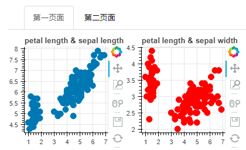

尝试点击，在不同面板间切换：

```python
from bokeh.io import output_notebook,show
from bokeh.models import Panel,Tabs
from bokeh.plotting import figure

p1 = figure(plot_width = 300,plot_height = 300)
p1.circle([1,2,3,4,5,6],[4,3,5,6,2,7],size = 20,color='red',alpha=0.8)
tab1 = Panel(child=p1,title='circle')

p2 = figure(plot_width = 300,plot_height = 300)
p2.line([1,2,3,4,5,6],[4,3,5,6,2,7],line_width = 3,color='navy',alpha = 0.5)
tab2 = Panel(child=p2,title = 'line')

output_notebook()
show(Tabs(tabs=[tab1,tab2]))
```

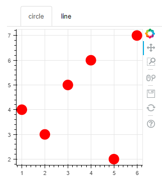

### 练习

创建网格布局：Bokeh 的网格布局可以使用`gridplot()`生成。

```python
import numpy as np
from bokeh.plotting import figure, output_notebook, show

# 准备数据
N = 100
x = np.linspace(0, 4*np.pi, N)
y0 = np.sin(x)
y1 = np.cos(x)
y2 = np.sin(x) + np.cos(x)
y3 = np.sin(x) - np.cos(x)


# 画四张图
p1 = figure(width=250, plot_height=250, title='sin(x)')
p1.circle(x, y0, size=10, color="navy", alpha=0.5)

p2 = figure(width=250, height=250, x_range=p1.x_range, y_range=p1.y_range, title='cos(x)')
p2.triangle(x, y1, size=10, color="firebrick", alpha=0.5)

p3 = figure(width=250, height=250, x_range=p1.x_range, title='sin(x) + cos(x)')
p3.square(x, y2, size=10, color="olive", alpha=0.5)

p4 = figure(width=250, height=250, x_range=p1.x_range, title='sin(x) - cos(x)')
p4.asterisk(x, y3, size=10, color="green", alpha=0.5)

# 从 bokeh.layouts 模块导入 gridplot 函数
from bokeh.layouts import gridplot

# 创建一个包含图片 p1 和 p2 的列表: row1
row1 = [p1,p2]

# 创建一个包含图片 p3 和 p4 的列表: row2
row2 = [p3,p4]

# 使用 row1 和 row2 创建网格布局: layout
layout = gridplot([row1,row2])


# 显示结果
output_notebook()
show(layout)
```

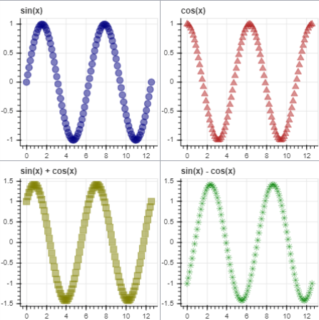

选项卡式布局

- 通过在`Bokeh`中将图或布局放置在面板中，可以创建选项卡式布局。
- 在本练习中，您将为每个图绘制一个Panel()。
- 您将在下一个练习中使用这些面板来构建和显示选项卡式布局。

```python
import numpy as np
from bokeh.plotting import figure,output_notebook,show

N = 100
x = np.linspace(0,4*np.pi,N)
y1 = np.sin(x)
y2 = np.cos(x)
y3 = np.sin(x) + np.cos(x)
y4 = np.sin(x) - np.cos(x)

#绘制图形
p1 = figure(width = 200,height = 200,title = 'sin(x)')
p1.circle(x,y1)

p2 = figure(width = 200,height = 200,title = 'cos(x)')
p2.triangle(x,y2,size=10,color='red')

p3 = figure(width = 200,height = 200,title = 'np.sin(x) + np.cos(x)')
p3.square(x,y3,size = 10,color = 'yellow',alpha =0.5)

p4 = figure(width = 200,height = 200,title = 'np.sin(x) - np.cos(x)')
p4.asterisk(x,y4,size = 10,color = 'green',alpha = 0.8)

from bokeh.models.widgets import Panel,Tabs
tab1 = Panel(child = p1,title = 'sin(x)')

tab2 = Panel(child = p2,title = 'cos(x)')

tab3 = Panel(child = p3,title = 'sin(x) + cos(x)')

tab4 = Panel(child = p4,title = 'sin(x) - cos(x)')

output_notebook()
show(Tabs(tabs=[tab1,tab2,tab3,tab4]))

```

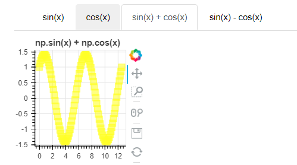

## 第3节  把图片连接在一起

目的：链接图片以增加图片之间的交互作用。 可以链接不同 Bokeh 绘图之间的各种交互操作。例如，可以链接两个（或多个）图的范围，以便在平移（或缩放）一个图或更改其范围时，链接在一起的其他图也会同步进行平移等操作。也可以在两个图之间链接选择，以便在一个图上选择项目时，第二个图上的相应项目也将被选择。


两种链接交互的方法：

- 链接平移(Linked Panning)
- 链接选择(Linked Brushing)


### 链接平移(Linked Panning)

通常需要在许多绘图之间进行链接平移。启用此功能所需要做的就是在figure（）函数中共享范围。拖拽其中任一绘图，其它绘制也会跟着一起动。

```python
from bokeh.io import show,output_notebook
from bokeh.layouts import gridplot
from bokeh.plotting import figure

x = list(range(11))
y0 = x
y1 = [10 - i for i in x]
y2 = [abs(i-3) for i in x]

#绘制图形一
s1 = figure(plot_width = 250,plot_height = 250,title = '正比')
s1.circle(x,y0,size = 10,color = 'navy',alpha = 0.8)

#绘制图形二并共享范围
s2 = figure(plot_width = 250,plot_height = 250,title = '10 - i',x_range = s1.x_range,y_range = s1.y_range)
s2.triangle(x,y1,size = 10,color = 'firebrick',alpha = 0.5)

#绘制图形三，并且共享范围
s3 = figure(plot_width = 250,plot_height = 250,title = 'abs(i - 3)',x_range = s1.x_range,y_range=s1.y_range)
s3.square(x,y2,size = 10,color = 'olive',alpha = 0.5)

p = gridplot([[s1,s2,s3]],toolbar_location = None)
output_notebook()
show(p)
```

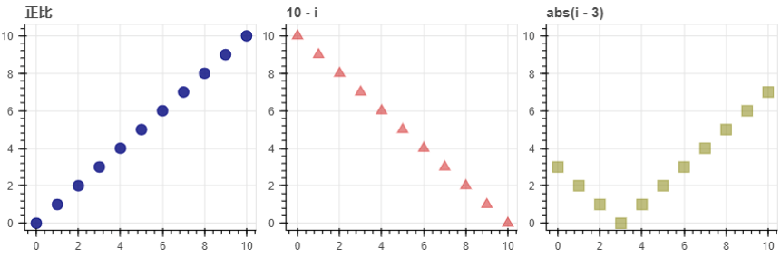

### 链接选择

使用共同的ColumnDataSource对象链接不同图像的选择。矩形选择工具（BoxSelectTool）和套索选择工具（LassoSelectTool）。它们都属于 bokeh 绘图工具中的拖动工具（Drag Tools）

```python
from bokeh.io import output_notebook,show
from bokeh.layouts import gridplot
from bokeh.models import ColumnDataSource
from bokeh.plotting import figure

x = list(range(-20,21))
y0 = [abs(i) for i in x]
y1 = [i**2 for i in x]

#创建图片共享的列数据源
source = ColumnDataSource(data = dict(x=x,y0=y0,y1=y1))

#自定义选择外观
Tools = "box_select,lasso_select,help"

#绘制左右两侧图形
left = figure(tools=Tools,plot_width = 250,plot_height = 250,title = None)
left.circle('x','y0',source = source)

right = figure(tools=Tools,plot_width = 250,plot_height = 250,title = None)
right.circle('x','y1',source = source)

p = gridplot([[left,right]])
output_notebook()
show(p)
```

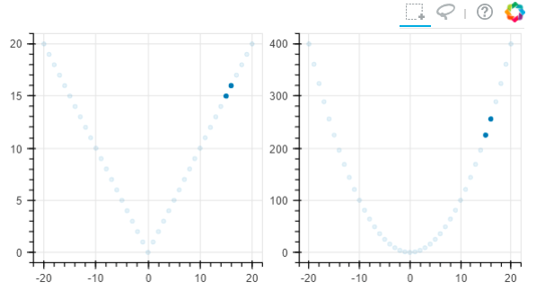

### 练习

练习一

链接轴：通过共享范围对象实现图形之间的链接轴。

```python
import numpy as np
from bokeh.plotting import figure,output_notebook,show
from bokeh.layouts import gridplot

N = 100
x = np.linspace(0,4*np.pi,N)
y1 = np.sin(x)
y2 = np.cos(x)
y3 = np.sin(x) + np.cos(x)
y4 = np.sin(x) - np.cos(x)

#画四张图
p1 = figure(width=250,height=250,title='sin(x)')
p1.circle(x,y1,size = 10,color='red',alpha=0.5)

p2 = figure(width=250,height=250,title='cos(x)')
p2.triangle(x,y2,size = 10,color='firebrick',alpha=0.5)

p3 = figure(width = 250,height = 250,title='sin(x)+cos(x)')
p3.square(x,y3,size = 10,color='olive',alpha=0.5)

p4 = figure(width = 250,height = 250,title='sin(x) + cos(x)')
p4.asterisk(x,y4,size=10,color='green',alpha=0.8)

p2.x_range = p1.x_range

p2.y_range = p1.y_range

p3.x_range = p1.x_range

p4.y_range = p1.y_range

row1 = [p1,p2]
row2 = [p3,p4]

layout = gridplot([row1,row2])

output_notebook()
show(layout)


```

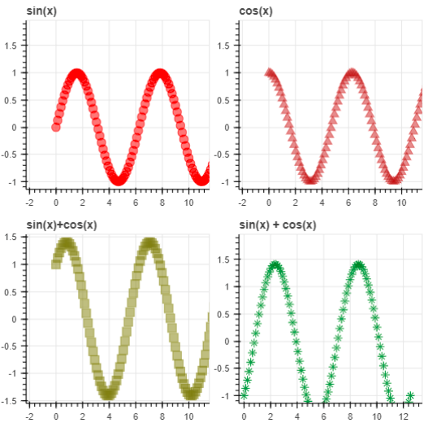

练习二

链接选择:在多个图之间共享同一 `ColumnDataSource` 对象，`BoxSelect` 和 `LassoSelect` 之类的选择工具将突出显示两个图中共享 `ColumnDataSource` 行的点。

- 使用相同的 `ColumnDataSource` 在两个图中绘制女性识字率与生育率以及人口与生育率的关系图。
- 构建完图形后，尝试使用套索选择工具和矩形选择工具。使用鼠标在一个图形中的点周围拖动一个矩形或套索，并注意在另一个图形中共享 `ColumnDataSource` 中的点也如何突出显示。

```python
from bokeh.io import output_notebook, show
from bokeh.plotting import figure
from bokeh.models import ColumnDataSource
from bokeh.layouts import row
import pandas as pd

data = pd.read_excel(r'D:\讲义\直播\Boken课程\data\Bokeh：布局、交互和标注\第3节 构建绘图之间的联动\TREND01-5G-educ-fertility-bubbles.xls', skiprows=7, nrows=162)

# 创建列数据源 ColumnDataSource: source
source = ColumnDataSource(data)

# 创建第一个 figure 对象: p1
p1 = figure(x_axis_label='fertility (children per woman)', y_axis_label='female literacy (% population)', tools ='box_select,lasso_select',width=200,height=200)

# 向 p1 中添加圆形字形
p1.circle('fertility', 'female literacy', source=source)

# 创建第二个 figure 对象: p2
p2 = figure(x_axis_label='fertility (children per woman)', y_axis_label='population (millions)', tools ='box_select,lasso_select',width = 400,height = 400)

# 向 p2 中添加圆形字形
p2.circle('fertility', 'population', source = source)

# 将 p1 和 p2 放入一行：layout
layout = row(p1, p2)

# 指定输出并显示
output_notebook()
show(layout)
```

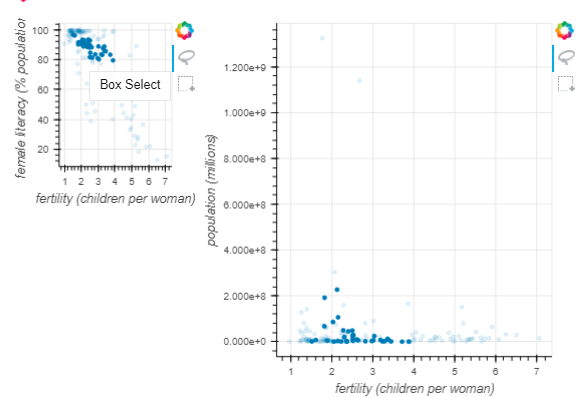

## 第4节 绘图标注和视觉导引

两种注释方法：

- 图例
- 悬停工具

通过在创建绘图时为字形方法指定图例参数，可以轻松创建图例注释。


一般有三种图例参数可以使用：

- legend_label
- legend_group
- legend_field

### 基本图例标签: legend_label

要为字形提供简单的显式标签，在绘图时，需要传入`legend_label`参数：如果给多个字形赋予了相同的标签，则它们将全部合并为带有该标签的单个图例项。

注：版本不一样，在有的地方是legend，而在另一些地方是legend_label

```python
import numpy as np
from bokeh.plotting import show,output_notebook,figure

x = np.linspace(0,4*np.pi,100)
y = np.sin(x)

p =figure()

p.circle(x,y,legend= 'sin(x)')
p.line(x,2*y,legend = '2*sin(x)',line_dash = [4,4],line_color = 'orange',line_width = 2)
p.square(x,3*y,legend = '3*sin(x)',fill_color = None,line_color='green')
p.line(x,3*y,legend = '3*sin(x)',line_color = 'green')

output_notebook()
show(p)
```

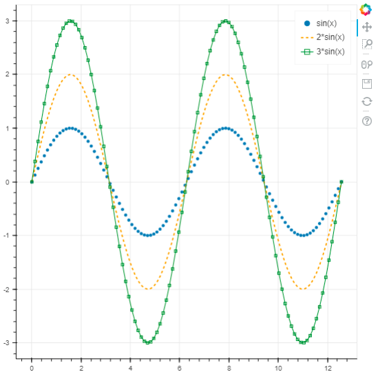

### legend_group()

对数据源列中的值进行分组操作来生成多个图例项。 将legend_group参数传入字形方法，Bokeh可以执行这样的分组：

p.circle('x', 'y', legend_group="colname", source=source)。使用此方法时，将立即在 Python 中执行分组，随后的 Python 代码将能够在Legend.items属性中查看各个图例项。 如果需要，可以重新安排或修改这些项目。

```python
from bokeh.models import ColumnDataSource
from bokeh.palettes import RdBu3
from bokeh.plotting import figure, output_notebook, show

c1 = RdBu3[2] # red
c2 = RdBu3[0] # blue

dict1 = {
    'x':[1, 2, 3, 4, 5, 6],
    'y':[2, 1, 2, 1, 2, 1],
    'color':[c1, c2, c1, c2, c1, c2],
    'label':['hi', 'lo', 'hi', 'lo', 'hi', 'lo']
}

source = ColumnDataSource(dict1)

p = figure(x_range=(0, 7), y_range=(0, 3), plot_height=300, tools='save')

# 图例字段与数据源中的 label 匹配
p.circle( x='x', y='y', radius=0.5, color='color', source=source)

output_notebook()
show(p)
```

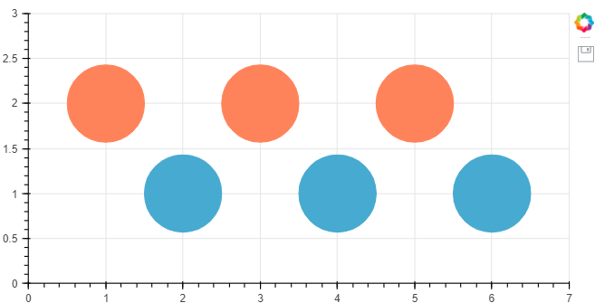

使用此功能，必须向字形方法提供source参数。 此外，此时要分组的列必须已经存在于数据源中。

legend_field() 我们在这里只作了解即可，并不常用。

在这种情况下，Python 代码在 Legend.items中看不到多个项目。相反，只有一个项目代表要在浏览器中执行的分组。

p.circle（'x'，'y'，legend_field =“ colname”，source = source）


图例也可以进行一些自定义设置（以图片 p 为例）：

- 设置图例：字体 (p.legend.label_text_font)、风格 (p.legend.label_text_font_style)、颜色 (p.legend.label_text_color)、字体大小 (p.legend.label_text_font_size)
- 设置图例外边线：宽度 (p.legend.border_line_width)、颜色 (p.legend.border_line_color)、透明度 (p.legend.border_line_alpha)
- 设置图例背景：颜色 (p.legend.background_fill_color)、透明度 (p.legend.background_fill_alpha)

总结

1、Line Properties → 线设置
（1）line_color，设置颜色
（2）line_width，设置宽度
（3）line_alpha，设置透明度
（4）line_join，设置连接点样式：'miter' miter_join，'round' round_join，'bevel' bevel_join
（5）line_cap，设置线端口样式，'butt' butt_cap，'round' round_cap，'square' square_cap
（6）line_dash，设置线条样式，'solid'，'dashed'，'dotted'，'dotdash'，'dashdot'，或者整型数组方式
2、Fill Properties → 填充设置
（1）fill_color，设置填充颜色
（2）fill_alpha，设置填充透明度
3、Text Properties → 字体设置
（1）text_font，字体
（2）text_font_size，字体大小，单位为pt或者em（ '12pt', '1.5em'）
（3）text_font_style，字体风格，'normal' normal text，'italic' italic text，'bold' bold text
（4）text_color，字体颜色
（5）text_alpha，字体透明度
（6）text_align，字体水平方向位置，'left', 'right', 'center'
（7）text_baseline，字体垂直方向位置，'top'，'middle'，'bottom'，'alphabetic'，'hanging'
4、可见性
p.xaxis.visible = False
p.xgrid.visible = False
基本参数中都含有.visible参数，设置是否可见


### 悬停工具

悬停工具将生成一个“表格”工具提示，其中每行包含一个标签及其相关值。 标签和值作为（标签，值）元组中的的列表提供。以@开头的字段名称与 ColumnDataSource 中的内容相关联。

```python
from bokeh.plotting import ColumnDataSource, figure, output_notebook, show

source = ColumnDataSource(data=dict(
    x=['1', '5', '6', '3', '4', '7'],
    y=[123, 153, 89, 107, 98, 23],
    desc=['A', 'b', 'C', 'd', 'e','f'],
))

TOOLTIPS = [
    ("index", "$index"),
    ("(x,y)", "($x, $y)"),
    ("desc", "@desc"),
]

p = figure(plot_width=400, plot_height=400, tooltips=TOOLTIPS,
           title="Mouse over the dots")

p.circle('x', 'y', size=20, source=source)

output_notebook()
show(p)

```

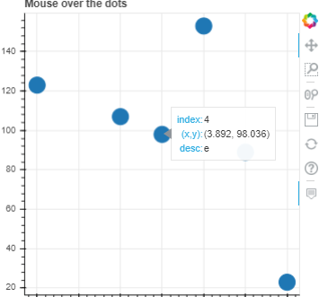

创建图例并进行设置

```python
from bokeh.io import output_notebook, show
from bokeh.plotting import figure
import numpy as np

x = np.arange(-1, 1, 0.1)

y1 = np.exp(x)
y2 = np.exp(2 * x)

p = figure(plot_width=600, plot_height=400)

# 画第一张图，并添加图例
p.circle(x, y1, size=10, color='lightblue', legend_label='exp(x)')

# 画第二张图，并添加图例
p.circle(x, y2, size=10, color='pink',  legend_label='exp(2 * x)')

# 将图例放在左上角 (top_left) :p.legend.location
p.legend.location = 'top_left'

# 将图例背景填充为浅灰色 (lightgray):p.legend.background_fill_color
p.legend.background_fill_color = 'lightgray'

output_notebook()
show(p)
```

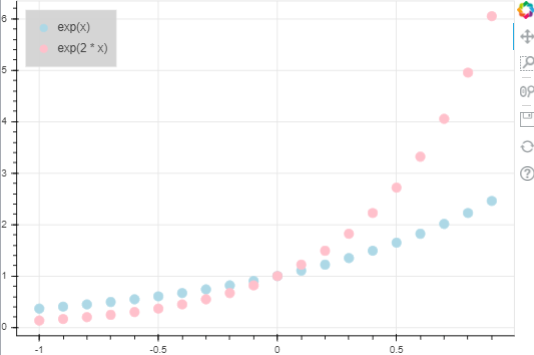