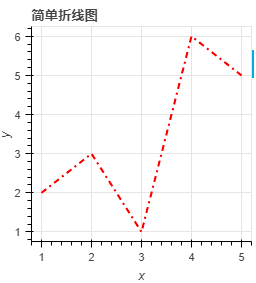
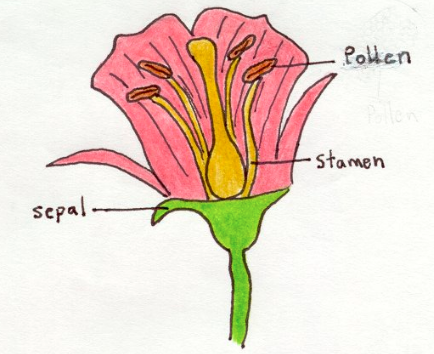
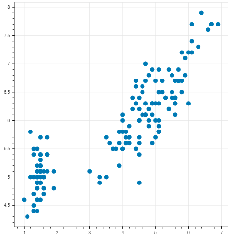

[TOC]

## 第一节 Bokeh实现数据可视化

bokeh官网：https://docs.bokeh.org/en/latest/docs/user_guide.html	

什么是boken：bokeh 是一个交互式的可视化库，为浏览器而生。

安装：pip install bokeh

bokeh 为用户设计了两种不同级别的接口

1.  bokeh.models ：一个较底层的接口，为开发人员提供最大灵活性
2. bokeh.plotting：一个封装较全的接口，用户只需关注视觉上的形状组合即可

### 什么是字形（Glyph）																				

- 视觉上的形状(shape)
  - 圆形（circle）
  - 正方形（square）
  - 三角形（triangle）
  - 矩形（rectangle）
  - 线条（line）
  - 斑块（patch）
  - 楔形（wedge）
  - $ \cdots $
- 和数据有关的属性（Property）
  - 坐标（coordinate）
  - 大小（size）
  - 颜色（color）
  - 透明度（transparecy）
  - $ \cdots $

### 绘图示例

文件展示的两种方式

- 输出到文件中：output_file(r'D:\student\文件.html')
- 输出到notebook中：output_notebook()

```python
from bokeh.io import output_file,show
from bokeh.plotting import figure

#画布，宽度为400  tools接受实际工作对象的列表
plot = figure(plot_width=400,tools='pan,box_zoom')
#调用画圆的方法，前两个参数为圆的位置，第三个为圆的大小
plot.circle([1,2,3,4,5],[8,6,5,2,3],size=10)
output_file('circle.html')
show(plot)
```


在当前页面显示，需要加上output_notebook()

```python
from bokeh.io import reset_output
from bokeh.plotting import figure,output_notebook,show

# 准备数据
x = [1, 2.5, 3, 2]
y = [2, 3, 1, 1.5]

#创建画布,tools为画布右侧的展示工具
p = figure(plot_width=300,plot_height=300,x_axis_label='x',y_axis_label='y',tools='pan,reset,save')

#添加一个圆的字形
p.circle(x,y,radius=0.3,alpha=0.5)

#设置四周边距一致
p.min_border = 40

#输出到notebook中
output_notebook()
show(p)
```


设置为其他形状

```python
from bokeh.plotting import figure,output_notebook,show

x = [1, 2, 3, 4, 5]
y = [6, 7, 5, 3, 5]

output_notebook()

p = figure(plot_width=400,plot_height=400)

#添加菱形字体,line_color菱形边的颜色，alpha透明度
p.diamond(x,y,size=20,fill_color='purple',line_color='purple',alpha=0.5)

p.min_border = 40

show(p)
```


### 标记（Mark）


### tools 默认有六种辅助工具

- 平移（Pan）
- 矩形缩放（Box Zoom）
- 鼠标滚轮缩放（Wheel Zoom）
- 保存（Save）
- 重置（Reset）
- 工具使用帮助

持久模式的清除：bokeh.io 库调用 `reset_output()` 函数清除该持久模式

### 案例展示

女性文化水平与生育能力散点图案例

```python
import numpy as np
import pandas as pd

#跳过前七行，读取160行
data = pd.read_excel(r'D:\讲义\直播\Boken课程\data\TREND01-5G-educ-fertility-bubbles.xls',skiprows=7,nrows=160)

fertility = data['fertility']
female_literacy = data['female literacy']

from bokeh.plotting import figure,output_notebook,show

p = figure(x_axis_label='fertility (children per woman)',y_axis_label='female_literacy (% population)')

p.circle(fertility,female_literacy)

output_notebook()

show(p)
```


绘制一个不同形状的散点图,并设置数据的颜色和透明度

```python
from bokeh.plotting import  figure,output_notebook,show
import numpy as np
import pandas as pd

data = pd.read_excel(r'D:\讲义\直播\Boken课程\data\TREND01-5G-educ-fertility-bubbles.xls',skiprows=7,nrows=162)

# 拉丁美洲：continent=LAT
fertility_latinamerica = data[data['Continent'] == 'LAT']['fertility']
female_literacy_latinamerica = data[data['Continent'] == 'LAT']['female literacy']

# 非洲: continent=AF
fertility_africa = data[data['Continent'] == 'AF']['fertility']
female_literacy_africa  = data[data['Continent'] == 'AF']['female literacy'] 

#创建画布
p = figure(x_axis_label='fertility (children per woman)',y_axis_label='female_literacy (% population)')

#添加圆形字形
p.circle(fertility_africa,female_literacy_latinamerica,color='red',size=10,alpha=0.5)

#添加x形字形
p.x(fertility_africa,female_literacy_africa,color='yellow',size=8,alpha=0.9)

output_notebook()
show(p)
```


## 第二节 更多类型

### 学习内容

- 线形（Line）
- 块形（Patch）
- 多个块形（Patchs）

线形图和标记mark组合

```python
from bokeh.plotting import output_notebook,show,figure,reset_output

x = [1,2,3,4,5]
y = [4,3,6,2,7]

p = figure()

p.line(x,y,line_width=3)

p.circle(x,y,fill_color='white',size=10)

output_notebook()

show(p)
```


块形，x,y数据代表块状的顶点

```python
from bokeh.plotting import figure,output_notebook,show

x = [3,2,1,2,1,2.8,2.8,3.2,3.2,5,4,5,4]
y = [6,5,5,4,2,2.8,1,1,2.8,2,4,5,5]

p = figure(x_range = [0,6],y_range = [0,6])

p.patch(x,y)

output_notebook()
show(p)
```


多个块形（Patches）

对于地理位置展示很有用，以列表嵌套列表的形式表现

```python
from bokeh.plotting import show,figure,output_notebook

xs = [[1,2,2,1],[3,4,4,3],[3,4,4,3]]
ys = [[1,1,2,2],[3,3,4,4],[5,5,6,6]]

p = figure()

p.patches(xs,ys,fill_color=['pink','skyblue','gold'],line_color='white')

output_notebook()
show(p)
```


### 常用字形


#### 1.折线字形

line() 函数

​	常用参数：

- line_width：线条宽度，默认是1			
- line_color：线条颜色			
- line_alpha：线条透明度			
- line_dash：线型，可以是 “solid”（实线）, “dashed”（虚线）, “dotted”（点线）, “dotdash”（点横线）等


​	绘制折线

```python
from bokeh.plotting import figure,output_notebook,show

x = [1,2,3,4,5]
y = [2,3,1,6,5]

output_notebook()

p = figure(title='简单折线图',x_axis_label='x',y_axis_label='y',plot_width=300,plot_height=300)
#添加一条直线
p.line(x,y,line_width=2,color='red',line_dash='dashdot')

#图距四周的距离
p.min_border = 40

show(p)

```



​	

​	绘制多条线，并设置线的形状

```python
import numpy as np
from bokeh.plotting import figure,show,output_notebook

x = np.linspace(0,4*np.pi,100)
y = np.sin(x)

p = figure(title='多个正弦曲线',plot_width=500,plot_height=500)

#第一条曲线,legend加上图例
p.line(x, y,legend='sin(x)')
p.circle(x,y,legend='sin(x)')

#第二条曲线
p.line(x,2*y,legend='2*sin(x)',line_dash='dashed',line_color='red',line_width=2)

#第三条曲线
p.square(x,3*y,legend='3*sin(x)',fill_color=None,line_color='green')
p.line(x,3*y,legend='3*sin(x)',line_color='yellow')

p.min_border = 40

output_notebook()
show(p)
```


​	绘制多条线

```python
from bokeh.plotting import figure,output_notebook,show

x = [[1,3,2,4],[3,4,5,6]]
y = [[1,2,2,4],[5,5,6,7]]

p = figure(plot_width=400,plot_height=400)

p.multi_line(x,y,color=['yellow','navy'],alpha=[0.8,0.9],line_width=5)
output_notebook()
show(p)
```


#### 2.块状字形

```python
from bokeh.plotting import figure,output_notebook,show

xs = [[2, 2, 4.5,4.5], [2, 3, 4, 3]]
ys = [[4.3, 4.5, 4.5,4.3], [3, 4, 3, 2]]

p = figure(plot_width=400,plot_height=400)

p.patches(xs,ys,
         fill_color=['yellow','red'],
         line_color='white',
         fill_alpha=0.6)

output_notebook()
show(p)

```


#### 3.条形图

```python
from bokeh.plotting import figure,output_notebook,show

p = figure()

#y代表柱形图的位置，height代表柱形图的宽度，left代表柱形图在左侧的位置，right表示柱形图的长度
p.hbar(y=[1,2,3,4],height=0.3,left=0,right=[1,2,3,2],color='yellow')

output_notebook()
show(p)
```


```python
from bokeh.plotting import figure,output_notebook,show

x = [1, 2, 3, 4, 5]  # 柱子所处的横坐标
y = [1.2, 2.5, 3.7, 1.5, 2.9]  # 柱子的高度

p = figure(title='柱状图',plot_width=300,plot_height=300)

p.vbar(x,top=y,width=0.5,bottom=0,color='yellow')

output_notebook()
show(p)
```


### 

### 练习

#### 1.2000年至2013年苹果公司股票（AAPL）的每日调整后收盘价。

```python
import numpy as np
import pandas as pd
from bokeh.plotting import figure,output_notebook,show

AAPL = pd.read_csv(r'D:\数据可视化代码\data\yahoo_finance\AAPL.csv')

date = AAPL['Date']
price = AAPL['Adj Close']

date = pd.to_datetime(date)

p = figure(x_axis_type='datetime',x_axis_label='Date',y_axis_label='US Dollars')

p.line(x=date,y=price)

output_notebook()
show(p)
```


#### 2.在折线拐点处设置点

```python
import pandas as pd
from bokeh.plotting import figure,show,output_notebook

AAPL = pd.read_csv(r'D:\数据可视化代码\data\yahoo_finance\AAPL.csv')

date = AAPL['Date']
price = AAPL['Adj Close']
#时间
date = pd.to_datetime(date)

#准备数据
df = pd.DataFrame(data={'date':date,'price':price})
df = df[(date >= '2019-03-01') & (date <= '2019-08-01')]

p = figure(x_axis_label='Date',y_axis_label='Price',x_axis_type='datetime')

p.line(date,price)
p.circle(date,price,color='yellow',size=4)

output_notebook()
show(p)
```


## 第三节 数据格式

### Numpy数组

```python
import numpy as np
from bokeh.plotting import figure,show,output_notebook

x = np.linspace(0,10,1000)
y = np.sin(x) + np.random.random(1000) * 0.2

p = figure()
p.line(x,y)

output_notebook()
show(p)
```


### Pandas 数据框



```python
from bokeh.plotting import figure,show,output_notebook
from bokeh.sampledata.iris import flowers

p = figure()

#flowers是pandas中的DataFrame结构
p.circle(flowers['petal_length'],
        flowers['sepal_length'],
        size=10)

output_notebook()
show(p)
```



### 列数据源（Column Data Source）

- Bokeh基本数据结构
- 将字符串的列名映射到数据序列，一般自动创建，可在数据间共享
- 额外的列可与悬停条共同使用

列数据源示例

```python
from bokeh.plotting import ColumnDataSource

source = ColumnDataSource(data={
    'x':[1,2,3,4,5,6],
    'y':[5,4,3,1,6,7]
})

source.data

结果为：{'x': [1, 2, 3, 4, 5, 6], 'y': [5, 4, 3, 1, 6, 7]}
```

```python
from bokeh.plotting import ColumnDataSource
from bokeh.sampledata.iris import flowers as df

source = ColumnDataSource(df)
```

#### 1. 直接提供数据

在 bokeh 中，可以将序列类型的数据直接传递到绘图函数中。

```python
from bokeh.plotting import figure,output_notebook,show

x_values = [1,2,3,4,5]
y_values = [2,5,3,5,7]

p = figure()

p.circle(x,y,size=10)

output_notebook()
show(p)
```


```python
from bokeh.plotting import show,figure,output_notebook
import numpy as np

x = np.linspace(0,10,1000)
y = np.sin(x) + np.random.random(1000)*0.2

p = figure(plot_width=300,plot_height=300)

p.line(x,y,color='yellow')

output_notebook()
show(p)
```


#### 2. 列数据源

列数据源是 bokeh 中大多数图的核心数据结构，由它提供数据，然后这些数据才可以被字形可视化显示；
使用列数据源，可以轻松地在多个图和 bokeh 小部件（例如 DataTable）之间共享数据；
当使用相同的列数据源创建多个字形时，数据源的选择也会被共享。

```python
from bokeh.plotting import show,figure,output_notebook
from bokeh.models import ColumnDataSource

data = {'x_values':[1,2,3,4,5],
       'y_values':[6,7,3,4,5]
       }

source = ColumnDataSource(data)

p = figure(plot_width=300,plot_height=300)

p.circle(x='x_values',y='y_values',source=source)

p.min_border = 40

output_notebook()
show(p)
```

##### 流（Streaming）

- 流方法（Stream method）可以将新数据附加到列数据源。 通过使用流方法，bokeh 可以仅将新数据发送到浏览器，而不是整个数据集。
- 流方法采用 `new_data` 参数，该参数接受一个字典，这个字典的列名需要映射到要附加到各个列的数据序列；
- 此外，还有一个可选参数 `rollover`，即要保留的最大数据长度（列开始部分的数据将被丢弃），默认值是 None，即允许数据无限增长。

```python
from bokeh.models import ColumnDataSource

#初始数据
source = ColumnDataSource(data = dict(foo=[1],bar=[2]))
print('初始数据：',source.data)
new_data = {
    'foo':[10,20],
    'bar':[100,200]
}

#使用流方法更新数据
source.stream(new_data)
print('更新后的数据：',source.data)

#参数从后面开始保留多少数据
source.stream(new_data,rollover=2)
print('保留后的数据:',source.data)

初始数据： {'foo': [1], 'bar': [2]}
更新后的数据： {'foo': [1, 10, 20], 'bar': [2, 100, 200]}
保留后的数据: {'foo': [10, 20], 'bar': [100, 200]}
```

### 练习

#### 使用Numpy数组

```python
from bokeh.plotting import figure,output_notebook,show
import numpy as np

x = np.linspace(0,6,100)
y = np.cos(x) + np.random.random(100)*0.2

p = figure(title='y=cos(x)')

p.line(x,y)

output_notebook()
show(p)
```


#### 从 pandas 绘制数据

```python
# 导入 pandas 库 ，别名 pd
import pandas as pd


# 读取数据
df = pd.read_csv("auto.txt")

# 从 bokeh.plotting 导入 figure,output_notebook,show
from bokeh.plotting import figure, output_notebook, show

# 创建 figure 对象: p
p = figure(x_axis_label='hp', y_axis_label='mpg')

# 画出 hp 对 mpg 的散点图，并指定颜色
p.circle(df['hp'], df['mpg'], color=df['color'], size=10)

# 指定输出并显示
output_notebook()
show(p)
```


#### boken的列数据源

```python
import pandas as pd
from bokeh.plotting import show,figure,output_notebook,ColumnDataSource

df = pd.read_csv(r'D:\讲义\直播\Boken课程\data\medals.txt') 
source = ColumnDataSource(df).data

p = figure()
p.circle(source['Year'],source['Time'])

output_notebook()
show(p)
```


## 第四节 自定义字形

### 自定义选择外观（Selection appearance）

选择图中的部分区域，需要使用选择工具。

​		矩形选择工具（BoxSelectTool）：名为 'box_select'，在绘图区域上拖动鼠标来定义矩形选择区域；

​		套索选择工具（LassoSelectTool）：名为 'lasso_select'，在绘图区域上拖动鼠标来定义要选择的任意区域。

它们都属于 bokeh 绘图工具中的拖动工具（Drag Tools）。

让选中的部分显示为自己想要的颜色，未选中的部分是另一种颜色

```python
from bokeh.plotting import figure,output_notebook,show,ColumnDataSource
from bokeh.sampledata.iris import flowers as df

source = ColumnDataSource(df)

p = figure(plot_width=300,plot_height=300,tools='box_select,lasso_select',title='选择区域')

#创建字形，使用列数据源，指定选择外观
p.circle(x='petal_length',y='sepal_length',source=source,
        selection_color='red',       #选中的颜色
        nonselection_alpha = 0.2,    #未选中点的透明度
        nonselection_color = 'gray') #未选中点的颜色

p.min_border = 20
output_notebook()
show(p)
```


- ​			清除选择，按 ESC 键。 
- ​			进行多项选择，请同时拖动鼠标和按 SHIFT 键。

### 自定义悬停外观（Hover appearance）


```python
import numpy as np
from bokeh.models import HoverTool

hover = HoverTool(tooltips=None,mode='hline')

p = figure(tools=[hover,'crosshair'])

x = np.random.random(size=100)
y = np.random.random(size=100)

p.circle(x,y,size=10,hover_color='red')

show(p)
```


### 颜色映射（Color mapping）

CategoricalColorMapper()` 函数可以将分类数据映射到颜色。

- `factors`：映射到某个目标范围的一系列类别；
- `palette`：用作映射目标调色板的一系列颜色列表。也可以将此属性设置为 String 类型，传递 `bokeh.palettes` 中显示的调色板的名称。

```python
from bokeh.models import CategoricalColorMapper
from bokeh.models import ColumnDataSource
from bokeh.sampledata.iris import flowers as df

source = ColumnDataSource(df)

mapper = CategoricalColorMapper(factors=['setosa', 'virginica','versicolor'],
                               palette=['red','green','blue'])

p = figure(x_axis_label='petal_length',y_axis_label='sepal_length')

p.circle('sepal_length','petal_length',size=10,source=source,color={'field':'species','transform':mapper})

show(p)
```


```python
from bokeh.plotting import figure,show,output_notebook
from bokeh.models import CategoricalColorMapper,ColumnDataSource

from bokeh.sampledata.iris import flowers as df

#创建列数据源
source = ColumnDataSource(df)

#创建类别颜色映射器
mapper = CategoricalColorMapper(factors=['setosa','virginica','versicolor'],
                               palette=['red','green','blue'])

#创建画布
p = figure(x_axis_label='petal_length',y_axis_label='sepal_length',plot_width=300,plot_height=300)

p.circle('petal_length','sepal_length',size=10,source=source,color={'field':'species','transform':mapper})

p.min_border = 20

output_notebook()
show(p)
```


对于连续型变量，可以使用 `LinearColorMapper()` 函数，将某个范围内的数字线性映射为一系列颜色

- low：映射到调色板的范围的最小值。 低于此值的值被限制为该值；
- high：要映射到调色板的范围的最大值。 高于此值的值将被限制为该值；
- palette：用作映射目标调色板的一系列颜色。也可以设置为 String 类型，传递 `bokeh.palettes` 中的调色板的名称。

### 调色板（Palette）

调色板是十六进制字符串的序列（列表或元组），表示一系列颜色。Bokeh提供了许多标准的 Brewer 调色板，可以从 `bokeh.palettes` 模块中导入它们。

```python
from bokeh.palettes import Spectral6
Spectral6

结果：('#3288bd', '#99d594', '#e6f598', '#fee08b', '#fc8d59', '#d53e4f')
```

### 练习

向图形添加`box_select`工具，并更改选定和未选定的圆形字形属性，以使选定的字形为红色，而未选定的字形为透明蓝色。

```python
from bokeh.plotting import ColumnDataSource,figure,output_notebook,show
import pandas as pd

df = pd.read_csv("medals.txt")

# 从 df 创建 source 的列数据源 ColumnDataSource
source = ColumnDataSource(df)

#利用 'box_select' 工具绘制 p
p = figure(x_axis_label='Year',y_axis_label='Time',tools='box_select')

#将圆形字形添加到具有选定和未选定属性的图形p
p.circle('Year','Time',size=10,
         source=source,
        selection_color='red',
        nonselection_color='blue',
        nonselection_alpha=0.1)

# 指定输出文件的名称并显示结果
output_notebook()
show(p)

```


添加一个悬停工具以显示有关每个散点的更详细信息

```python
# %%nose # 用于平台环境配置，请勿删除

from bokeh.io import output_notebook, show, curdoc
from bokeh.plotting import figure
from bokeh.models import HoverTool, ColumnDataSource
import pandas as pd

data = pd.read_csv('/data/course_data/bokeh/gapminder_tidy.csv')

# 制作 ColumnDataSource: source
source = ColumnDataSource(data={
    'x': data[data.Year == 1970].fertility,
    'y': data[data.Year == 1970].life,
    'country': data[data.Year == 1970].Country,
    'pop': (data[data.Year == 1970].population / 20000000) + 2,
    'region': data[data.Year == 1970].region,
})

# 保存 fertility 列的最大值和最小值: xmin, xmax
xmin, xmax = min(data.fertility), max(data.fertility)

# 保存 life expectancy 列的最大值和最小值: ymin, ymax
ymin, ymax = min(data.life), max(data.life)

# 列出 region 列中的唯一值: regions_list
regions_list = data.region.unique().tolist()

# 从 bokeh.models 导入 CategoricalColorMapper 从 bokeh.palettes 导入 Spectral6 palette
from bokeh.models import CategoricalColorMapper
from bokeh.palettes import Spectral6

# 制作颜色映射器: color_mapper
color_mapper = CategoricalColorMapper(factors=regions_list, palette=Spectral6)

# 创建画布: plot
plot = figure(title='Gapminder Data for 1970', plot_height=400, plot_width=700,
              x_range=(xmin, xmax), y_range=(ymin, ymax))
# 将颜色映射器添加到圆形字形
plot.circle(x='x', y='y', fill_alpha=0.8, source=source,
            color=dict(field='region', transform=color_mapper), legend_field='region')

# 设置 x 轴标签
plot.xaxis.axis_label = 'Fertility (children per woman)'

# 设置 y 轴标签
plot.yaxis.axis_label = 'Life Expectancy (years)'

# 创建图例位置 'top_right'
plot.legend.location = 'top_right'

#### 增加滑块


from bokeh.layouts import row
from bokeh.models import Slider


# 定义回调函数: update_plot
def update_plot(attr, old, new):
    # 将 yr 名称设置为 slider.value，将 new_data 设置为 source.data
    yr = slider.value
    new_data = {
        'x': data[data.Year == yr].fertility,
        'y': data[data.Year == yr].life,
        'country': data[data.Year == yr].Country,
        'pop': (data[data.Year == yr].population / 20000000) + 2,
        'region': data[data.Year == yr].region,
    }
    source.data = new_data
    # 添加图片标题
    plot.title.text = 'Gapminder data for %d' % yr


# 制作滑块对象: slider
slider = Slider(start=1970, end=2010, step=1, value=1970, title='Year')

# 将回调附加到滑块的'value'属性
slider.on_change('value', update_plot)

### 添加悬停工具

# 从 bokeh.models 导入 HoverTool
from bokeh.models  import HoverTool

# 创建一个悬停工具: hover
hover = HoverTool(tooltips =[('Country', '@country')])

# 在图片中添加悬停工具
plot.add_tools(hover)

layout = row(slider, plot)
curdoc().add_root(layout)
curdoc().title = 'Gapminder'

from bokeh.plotting import show,output_notebook,figure

output_notebook()
show(plot)
```

